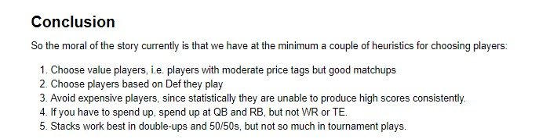

# Daily Fantasy Football Player Picking System

*Sports betting is a [203 billion dollar industry in 2020](https://www.statista.com/statistics/1154681/key-data-global-sports-betting-industry/), and getting bigger every year. One subset of sports betting, Daily Fantasy Sports (DFS), is [immensely popular](https://www.businesswire.com/news/home/20210111005708/en/2020-Fantasy-Sports-Industry-Report---ResearchAndMarkets.com#:~:text=According%20to%20the%20Fantasy%20Sports,reach%20150%20million%20by%202022.). Due to the popularity though, it is difficult to pick players that perform well week-to-week, but also don't match what everyone else is picking. For this project, I set out to create a system that better predicts high scoring players for DraftKings Classic games.*

## 1. Data

There are several sites that peddle fantasy data for a fee, which for the sake of this project, were avoided (although it would a great idea to use their data in the future because it is much, much more thorough). There were, however, a few hobby sites that not only had the data readily accessible, but also accessible for free:

> * [Pro Football Reference](https://www.pro-football-reference.com)

> * [RotoGuru](http://rotoguru.net/)

> * [DraftKings](https://www.draftkings.com)

These data were collected and joined together for purposes of training the models.

## 2. Method

The goal was to predict DFS point output of players, and I had to choose between regression and classifcation. Initially, I had decided to make this a classification problem, where I would train models to predict "tiers" of players, but in the end, this model had pretty low performance. After changing to regression modeling, performance went up.

**WINNER: Regression Modeling** 

The classification model created "tiers" of players, but sometimes the pools were way, way off. As a result, lineups built with those players were mostly low-performing. Regression on the other hand, did really well in 2 aspects: 

1. Filtering bad players
2. Picking good players from those results

## 3. Data Cleaning 

Because the data is maintained by hobbyists, I expected this to be much harder. The data cleaning portion was very straightforward, with only minor issues. Thank goodness for dedicated sports stats people!

* **Problem 1:** Some of the salaries were missing. **Solution:** A lot of players that had missing salaries were low performers anyways, but due to the nature of football, with injuries and substitutions, there are often times what are called "sleeper" players. So these had to be accounted for. For exploration, I tested 2 methods: substituting the mean player salary, and then minimizing their affects by giving them outrageous salaries (orders of magnitude larger). Neither helped in predicting sleepers, so I chose to minimize those players for the sake of training the models. 

* **Problem 2:** The data that I thought would be useful was separated across a few different websites.  **Solution:** Built a scraper that grabs the data off those sites and joins it altogether. 

## 4. EDA

First, some notes about DraftKings Football DFS.

* While there are many different types of formats, 2 of the most played are Tournament and Double-ups (aka 50/50).
* In Tournament formats, we are looking to score the absolute highest score possible. So players picked are chosen because of their potential to get as many points as possible.
* In the other formats (Double Ups and 50/50s), we only need to beat around \~50\% of the field in order to be in the money (ITM).

With that said, here's the conclusion from the EDA:

## 5. Algorithms & Machine Learning

I tested several different regression models from [SciKit Learn](https://scikit-learn.org/stable/)'s regression models. After finding a few that were close in performance, tuning brought about some bigger disparities that made Gradient Boost the winner for the filtering function of the algorithm and Ada Boost the winner of the player picking part of the algorithm.

>***NOTE:** I chose RMSE to control for dealing with outliers in the data. It's hard to consistently find players that score more than 30, 40 points, and some weeks they don't even occur. So RMSE would, because we are taking the root of those errors, control for those random high performers a little better.*

## 6. Pseudo-Coldstart Threshold
**Coldstart Threshold**: Recommender systems have a unique issue: *what does the algorithm recommend to new users when it has very little or no prior data?* I decided there were 2 options:

- Use last year's season data as a whole to make a decision for week 1 of this season.
- Wait for week 1's data in order to begin during week 2.

Because of how draft's work and the copious amounts of trades during the off-season, I decided to wait til week 1 was over and begin the process then.

## 7. Predictions

In the final predictions notebook, the user can upload a DraftKings template and get player picks.

## 8. Future Improvements

* Incorporating more stats (def ratings vs. positions, QB ratings, targets, yardage, etc.) into the model I think would make it more robust.

* Instead of breaking down all the players at the same time, breaking down players by position, with algorithms for each individual position.

## 9. Credits

Thanks to [Draftkings](https://www.draftkings.com), [RotoGuru](http://rotoguru.net/), and [Pro Football Reference](https://www.pro-football-reference.com) for making their data publicly accessible, and Mukesh Mithrakumar for being an extrememly knowledgeable and patient Springboard mentor.